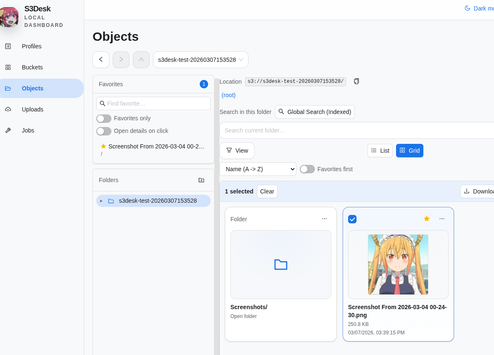

# S3Desk

S3Desk is a self-hosted dashboard for multi-provider object storage. It combines
profile management, bucket and object browsing, uploads, transfer tracking,
jobs, and backup workflows in one UI.




## What It Does

- Connect to multiple object-storage providers from one UI.
- Browse buckets and prefixes, preview objects, and run common object actions.
- Queue uploads and downloads, then track them from the Transfers and Jobs
  surfaces.
- Export sqlite-backed snapshot backups, stage restores, and run portable migration flows.
- Support browser-facing deployments with reverse proxies, `download-proxy`,
  `publicEndpoint`, and explicit external base URL handling.

## Quick Start

### Seeded Demo Stack

Bring up the demo stack with a pre-seeded MinIO profile and sample bucket:

```bash
./scripts/compose.sh demo up --build -d
```

Default local demo endpoints:

- UI: `http://127.0.0.1:8080`
- MinIO API: `http://127.0.0.1:9000`
- MinIO Console: `http://127.0.0.1:9001`
- API token: `demo-token`
- Seeded profile name: `MinIO Demo`
- Seeded bucket: `demo-bucket`

This path is intended for fast local evaluation, not hardened remote exposure.

### Local Development

Run the backend and frontend together:

```bash
./scripts/dev.sh
```

Default local development endpoints:

- Frontend dev server: `http://127.0.0.1:5173`
- UI and API: `http://127.0.0.1:8080`
- API docs: `http://127.0.0.1:8080/docs`
- OpenAPI spec: `http://127.0.0.1:8080/openapi.yml`

## Typical Workflow

1. Create a profile in `Profiles` and run the connection test before saving.
2. Open `Buckets` to verify listing works and create a bucket or container when the provider supports it.
3. Open `Objects` to browse prefixes, preview objects, and run copy, move, rename, delete, or download actions.
4. Open `Uploads` to stage local files and `Transfers` / `Jobs` to watch runtime progress and failures.
5. Use the sidebar `Backup` drawer when you need sqlite snapshot exports, staged restores, or portable migration preview/import.

## Build Requirements

- Go `1.24+`
- Node.js `22.x`
- npm `10.9.4` recommended
- Docker and Docker Compose for container-based workflows

## Build From Source

Build the frontend bundle, backend binary, and packaged `dist/` artifacts:

```bash
./scripts/build.sh
```

Build outputs:

- `dist/s3desk-server`
- `dist/ui`
- `dist/openapi.yml`

## Verification

Run the standard local verification pass:

```bash
./scripts/check.sh
```

This covers:

- OpenAPI validation
- Release-gate checks
- Backend formatting, vet, and tests
- Frontend OpenAPI sync check, lint, unit tests, and build
- Third-party notice regeneration checks

For focused commands and live/environment-gated workflows, see
[docs/TESTING.md](docs/TESTING.md).

## Deployment Paths

### Local Container Build

Build and run the current checkout with Postgres using the local-only compose
file:

```bash
export API_TOKEN='set-a-local-token'
./scripts/compose.sh dev up --build -d
```

`./scripts/compose.sh dev` is intentionally local-only:

- binds `127.0.0.1:${S3DESK_PORT:-8080}` on the host
- keeps `ALLOW_REMOTE=false`
- requires an explicit `API_TOKEN`

### Remote Postgres Deployment

Use the `remote` compose wrapper with [.env.example](.env.example):

Start from:

```bash
cp .env.example .env
$EDITOR .env
./scripts/compose.sh remote up -d
```

Important remote deployment settings:

- `S3DESK_BIND_ADDRESS`
- `API_TOKEN`
- `POSTGRES_PASSWORD`
- `EXTERNAL_BASE_URL` when users access S3Desk through a hostname or proxy
- `ALLOWED_HOSTS` for non-private hostnames

See [.env.example](.env.example) for the full template.

### Helm Deployment

Use the bundled chart for Kubernetes deployments:

```bash
helm upgrade --install s3desk ./charts/s3desk \
  --namespace s3desk \
  --create-namespace \
  --set-string server.apiToken='replace-me-with-a-strong-token'
```

For browser-facing deployments, also set:

- `server.externalBaseURL`
- `ingress.*` or `istio.virtualService.*`
- `db.backend=postgres` plus `db.databaseUrl` or `secrets.existingSecret` when using Postgres

The chart now exposes first-class values for DB startup tuning, restore upload limits,
upload concurrency, and rclone download tuning. See [charts/s3desk/README.md](charts/s3desk/README.md)
for install examples and operational notes.

### Public HTTPS with Caddy

For a Caddy-fronted public deployment, use:

- `./scripts/compose.sh caddy`
- `deploy/caddy/Caddyfile`

At minimum, set:

- `S3DESK_DOMAIN`
- `EXTERNAL_BASE_URL`
- `ALLOWED_HOSTS`

Then start it with:

```bash
./scripts/compose.sh caddy up -d
```

See [docs/RUNBOOK.md](docs/RUNBOOK.md) for the full checklist, reverse-proxy
smoke commands, and browser-facing download expectations.

## Backup and Restore

The in-product backup UI now lives in the main sidebar `Backup` drawer.

Available flows:

- `Full backup`: sqlite-backed `DATA_DIR` snapshot plus local state used for
  same-backend recovery.
- `Cache + metadata backup`: lighter sqlite backup that keeps metadata and
  selected cache state such as thumbnails.
- `Portable backup`: database-neutral export path for portable preview/import
  workflows.
- `Stage restore bundle`: uploads a backup bundle under
  `DATA_DIR/restores/<restore-id>` for review and manual cutover.
- `Portable import preview/import`: dry-run and replace-style import flow for
  portable bundles.

Payload protection modes:

- clear archive
- `ENCRYPTION_KEY`-backed encrypted payload
- password-protected encrypted payload

Important scope boundaries:

- In-product `Full backup` and `Cache + metadata backup` are for sqlite-backed
  `DATA_DIR` state.
- Postgres deployments still need a separate database backup workflow such as
  `pg_dump`, physical base backups, WAL archiving, or managed snapshots.
- A staged restore bundle does not replace a Postgres database restore.
- `Portable backup` / portable import is the database-neutral migration path,
  not a generic Postgres disaster-recovery feature.
- `Portable backup` is supported for `sqlite -> postgres` and `postgres -> sqlite`
  migration paths.

For operational details, see:

- [docs/RUNBOOK.md](docs/RUNBOOK.md)
- [docs/PORTABLE_BACKUP.md](docs/PORTABLE_BACKUP.md)
- [docs/TESTING.md](docs/TESTING.md)

Compose-based portable migration smoke:

```bash
./scripts/run_portable_sqlite_to_postgres_smoke.sh
./scripts/run_portable_postgres_to_sqlite_smoke.sh
```

Encrypted/password-protected portable migration smoke:

```bash
PORTABLE_BUNDLE_CONFIDENTIALITY=encrypted \
PORTABLE_BUNDLE_PASSWORD=operator-secret \
./scripts/run_portable_sqlite_to_postgres_smoke.sh

PORTABLE_BUNDLE_CONFIDENTIALITY=encrypted \
PORTABLE_BUNDLE_PASSWORD=operator-secret \
./scripts/run_portable_postgres_to_sqlite_smoke.sh
```

Failure-path portable smoke:

```bash
./scripts/run_portable_failure_smoke.sh
./scripts/run_portable_postgres_to_sqlite_failure_smoke.sh
```

## Browser-Facing Deployment Notes

For remote and reverse-proxied deployments:

- set `EXTERNAL_BASE_URL` to the browser-facing origin
- set `ALLOWED_HOSTS` when using non-private hostnames
- use `publicEndpoint` on S3-compatible profiles when browsers need a different
  hostname than the server-side storage endpoint
- keep using `download-proxy` when browsers should not hit the storage endpoint
  directly

The reverse-proxy and browser-download validation path is documented in
[docs/RUNBOOK.md](docs/RUNBOOK.md) and [docs/TESTING.md](docs/TESTING.md).

## API Surface

Built-in endpoints:

- UI: `http://127.0.0.1:8080`
- API docs: `http://127.0.0.1:8080/docs`
- OpenAPI spec: `http://127.0.0.1:8080/openapi.yml`

If `API_TOKEN` is enabled, send it with `X-Api-Token` or
`Authorization: Bearer <token>`.

## Documentation

- [Docs index](docs/README.md)
- [Providers](docs/PROVIDERS.md)
- [Portable backup](docs/PORTABLE_BACKUP.md)
- [Bucket governance](docs/BUCKET_GOVERNANCE.md)
- [Runbook](docs/RUNBOOK.md)
- [Testing](docs/TESTING.md)
- [Release gate](docs/RELEASE_GATE.md)

## Demo Flow

Profile selection, bucket creation, file upload, object deletion, and jobs
view:


## License

This project is licensed under the Mozilla Public License 2.0 (`MPL-2.0`).

See [LICENSE](LICENSE).
