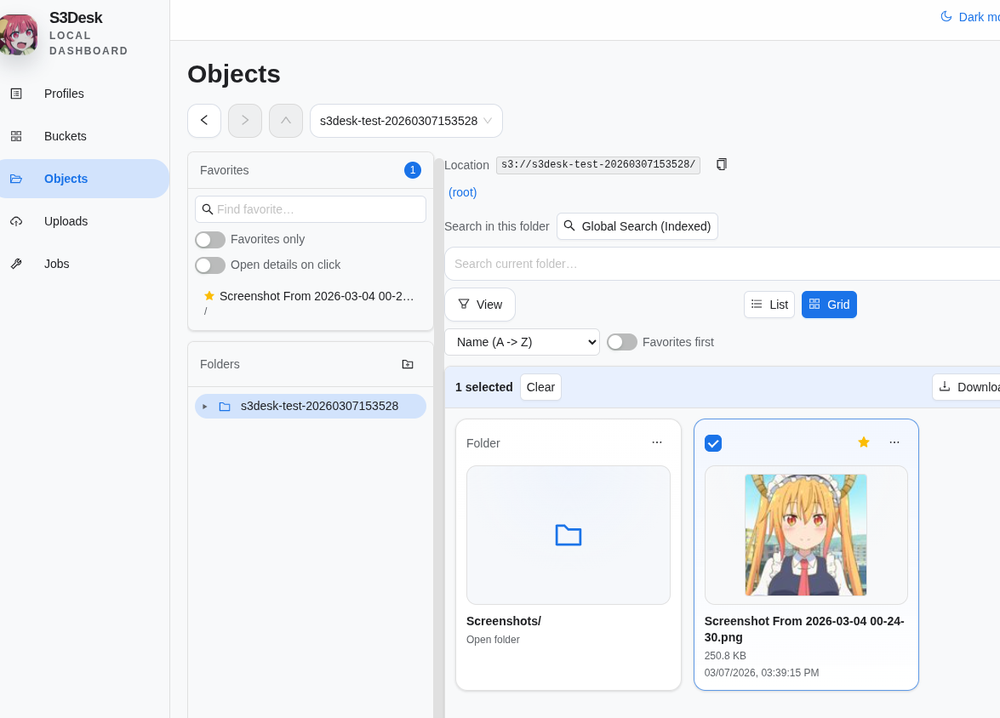

# S3Desk

S3Desk is a self-hosted dashboard for multi-provider object storage.

- multiple provider profiles in one UI
- bucket and object browsing
- uploads, transfers, and jobs
- sqlite snapshot backup and portable migration flows




## Quick Start

### Demo

```bash
./scripts/compose.sh demo up --build -d
```

Default demo endpoints:

- UI: `http://127.0.0.1:8080`
- MinIO API: `http://127.0.0.1:9000`
- MinIO Console: `http://127.0.0.1:9001`
- API token: `demo-token`

### Local Development

```bash
./scripts/dev.sh
```

Default local endpoints:

- frontend dev server: `http://127.0.0.1:5173`
- UI and API: `http://127.0.0.1:8080`
- API docs: `http://127.0.0.1:8080/docs`
- OpenAPI spec: `http://127.0.0.1:8080/openapi.yml`

### Build and Check

Requirements:

- Go `1.25.10` for the pinned backend toolchain (`backend/go.mod` declares `go 1.25.0` with `toolchain go1.25.10`)
- Node.js `22.x`
- npm `10.9.4` is the recommended local version used by the check scripts
- Python 3 with PyYAML (`python3-yaml` on Debian/Ubuntu) for workflow validation
- Helm for the full repository gate
- Docker / Podman compose for container workflows

```bash
./scripts/build.sh
./scripts/check.sh
```

### CI Verification

The CI-facing execution path is intentionally explicit:

- frontend build: `cd frontend && npm run build`
- backend tests: `cd backend && go test ./...`
- repository gate: `./scripts/check.sh`

`./scripts/build.sh` remains a local convenience wrapper; release and CI gates use
`./scripts/check.sh` as the source of truth for frontend, backend, Helm, workflow,
and release-policy checks.

## Deployment

### Remote Compose

```bash
cp .env.example .env.local
$EDITOR .env.local
set -a; . ./.env.local; set +a
./scripts/compose.sh remote up -d
```

The repository root `.env` is checked in for non-secret compose defaults. Keep
deployment secrets in exported environment variables or ignored local files such
as `.env.local`; do not commit real `API_TOKEN` or `POSTGRES_PASSWORD` values.

Important remote settings:

- `S3DESK_BIND_ADDRESS`
- `API_TOKEN`
- `POSTGRES_PASSWORD`
- `ALLOWED_LOCAL_DIRS`
- `EXTERNAL_BASE_URL`
- `ALLOWED_HOSTS`

### Public HTTPS with Caddy

```bash
./scripts/compose.sh caddy up -d
```

Set at least:

- `S3DESK_DOMAIN`
- `EXTERNAL_BASE_URL`
- `ALLOWED_HOSTS`
- `API_TOKEN`
- `POSTGRES_PASSWORD`
- `ALLOWED_LOCAL_DIRS`

### Helm

```bash
API_TOKEN="$(openssl rand -base64 32)"
helm upgrade --install s3desk ./charts/s3desk \
  --namespace s3desk \
  --create-namespace \
  --set-string server.apiToken="${API_TOKEN}"
```

For Postgres-backed installs, also set `db.backend=postgres` plus either
`db.databaseUrl` or `secrets.existingSecret`.

For operational details, use [docs/RUNBOOK.md](docs/RUNBOOK.md) and
[charts/s3desk/README.md](charts/s3desk/README.md).

## Backup and Restore

The sidebar `Backup` drawer exposes three distinct paths:

- `Full backup`: sqlite `DATA_DIR` snapshot for same-backend recovery
- `Cache + metadata backup`: lighter sqlite snapshot with selected local assets
- `Portable backup`: logical export/import for `sqlite <-> postgres` migration

Important boundaries:

- sqlite snapshot backup is not a Postgres disaster-recovery feature
- staged restore uploads a bundle for review; it does not restore a running Postgres database
- portable backup/import is the database-neutral migration path

Portable smoke commands:

```bash
bash scripts/run_portable_sqlite_to_postgres_smoke.sh
bash scripts/run_portable_postgres_to_sqlite_smoke.sh
bash scripts/run_portable_failure_smoke.sh
bash scripts/run_portable_postgres_to_sqlite_failure_smoke.sh
```

For encrypted bundles:

```bash
PORTABLE_BUNDLE_CONFIDENTIALITY=encrypted \
PORTABLE_BUNDLE_PASSWORD=operator-secret \
bash scripts/run_portable_sqlite_to_postgres_smoke.sh
```

More detail lives in [docs/PORTABLE_BACKUP.md](docs/PORTABLE_BACKUP.md).

## Typical Flow

1. Create a provider profile in `Profiles`.
2. Check buckets in `Buckets`.
3. Browse and act on objects in `Objects`.
4. Stage uploads in `Uploads`.
5. Watch progress and failures in `Transfers` and `Jobs`.

## Docs

- [docs/README.md](docs/README.md)
- [docs/RUNBOOK.md](docs/RUNBOOK.md)
- [docs/TESTING.md](docs/TESTING.md)
- [docs/PROVIDERS.md](docs/PROVIDERS.md)
- [docs/PORTABLE_BACKUP.md](docs/PORTABLE_BACKUP.md)
- [docs/BUCKET_GOVERNANCE.md](docs/BUCKET_GOVERNANCE.md)
- [docs/RELEASE_GATE.md](docs/RELEASE_GATE.md)
- [notes/INDEX.md](notes/INDEX.md)

## License

MPL-2.0. See [LICENSE](LICENSE).
