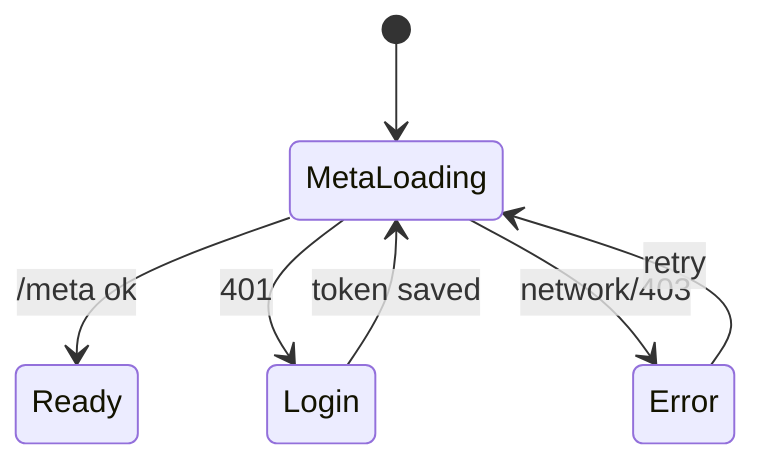
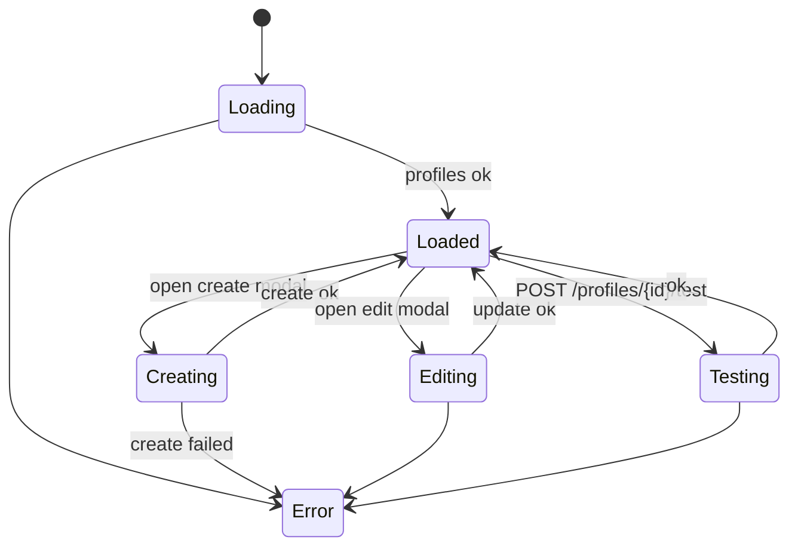
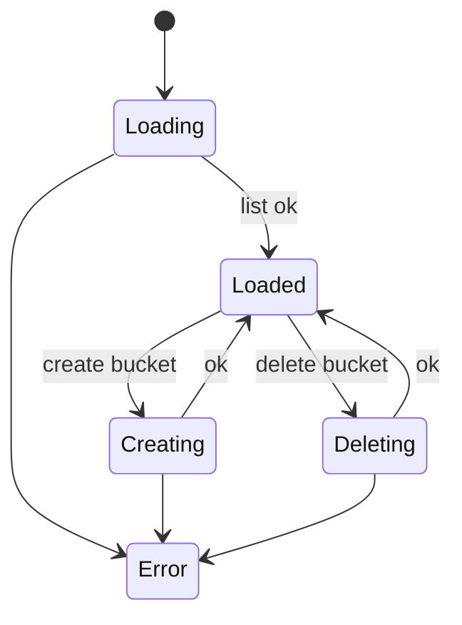
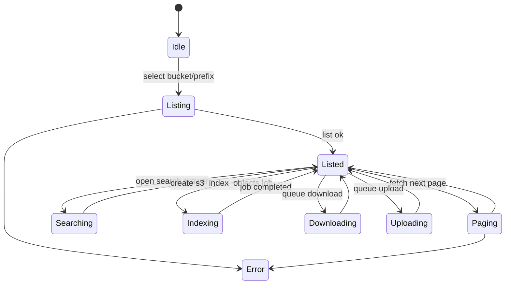
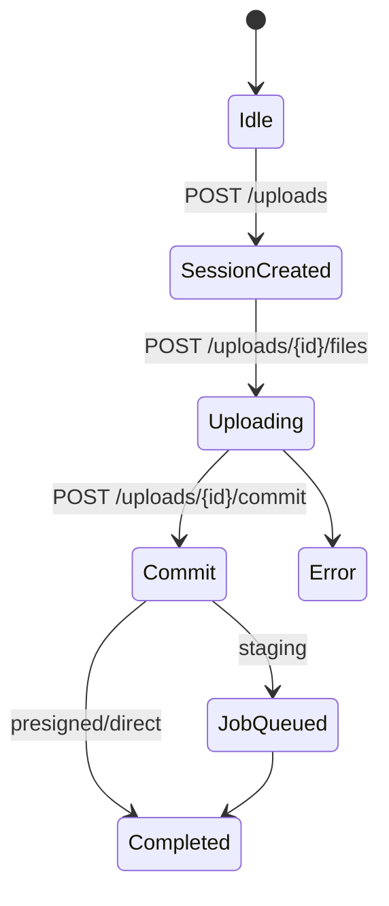
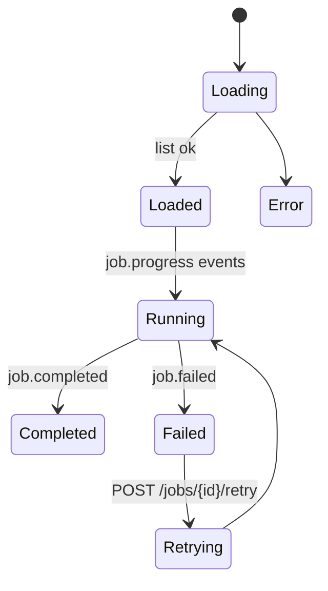
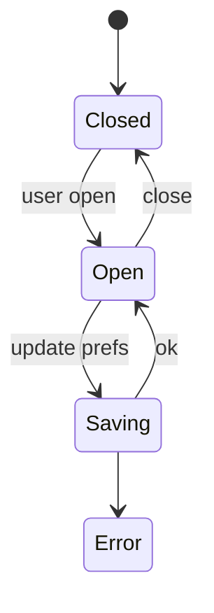
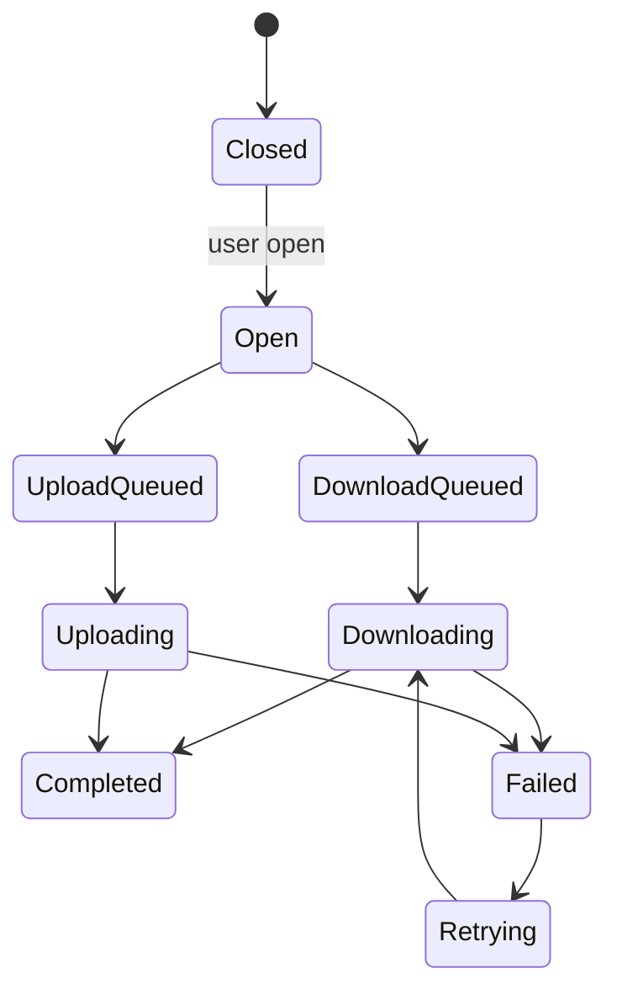

# UI State Maps (Page-level)

State diagrams are based on the current frontend implementation in `frontend/src`.

## App/Auth Gate

## Profiles Page

## Buckets Page

## Objects Page

## Uploads Page

## Jobs Page

## Settings

## Transfers (global drawer)

